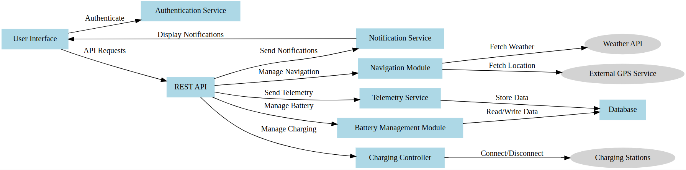
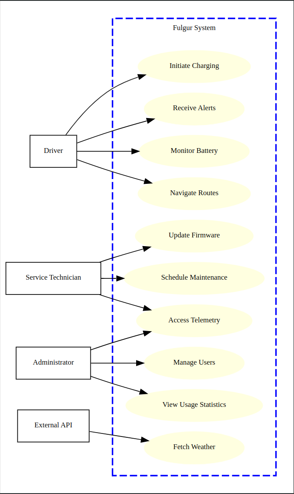

# Fulgur

## Table of Contents
- [Overview](#overview)
- [Technology Stack](#technology-stack)
- [Features](#features)
- [System Design](#system-design)
  - [1. System Selection](#1-system-selection)
  - [2. System Boundaries](#2-system-boundaries)
  - [3. System Interfaces](#3-system-interfaces)
- [Installation](#installation)
  - [Prerequisites](#prerequisites)
  - [Setup Instructions](#setup-instructions)
- [Usage](#usage)
- [Project Structure](#project-structure)

## Overview
The **Fulgur** is a web-based application designed to simulate and manage various functionalities of an electric vehicle. It provides real-time insights into the vehicle's battery status, navigation, and charging processes. The system dynamically generates architectural diagrams to visualize its components and use cases, enhancing understanding and facilitating better system management.

## Technology Stack
- **Backend Framework:** Flask (Python)
- **Diagram Generation:** Graphviz (Python graphviz library)
- **Containerization:** Docker
- **Orchestration:** Docker Compose
- **Frontend:** HTML, CSS

## Features
- **Dynamic Diagram Generation:** Automatically generates and displays component and use case diagrams in SVG format.
- **Real-Time Data Simulation:** Mimics real-time battery monitoring and navigation functionalities.
- **Web Interface:** User-friendly dashboard to view system diagrams and interact with simulated functionalities.
- **Containerized Deployment:** Easily deployable using Docker for consistent environments across different platforms.

## System Design

### 1. System Selection
**Chosen System:** Fulgur

#### Functional Requirements:

- **Battery Monitoring:**
  - **Description:** Track and display the current battery level, charging status, and estimated range.
  - **Functionality:** The system should provide real-time updates on battery health, remaining charge, and notify the user when charging is needed.

- **Navigation and Routing:**
  - **Description:** Provide real-time navigation, route optimization, and location services.
  - **Functionality:** The system should offer turn-by-turn navigation, suggest optimal routes based on traffic conditions, and update the route dynamically as needed.

#### Non-Functional Requirement:

- **Real-Time Performance:**
  - **Description:** The system must process and display data in real-time with minimal latency.
  - **Importance:** Ensures that the user receives timely and accurate information, enhancing the overall user experience and safety.

### 2. System Boundaries

**Inside the System:**

- **User Interface (UI):**
  - **Function:** Provides a dashboard for displaying battery status, navigation maps, and user controls.

- **Battery Management Module:**
  - **Function:** Monitors and manages battery performance and charging processes.

- **Navigation Module:**
  - **Function:** Handles GPS data, route calculations, and integrates traffic updates for optimal routing.

- **Communication Module:**
  - **Function:** Interfaces with external services to fetch real-time data such as traffic and weather conditions.

**Outside the System:**

- **Driver/User:**
  - **Role:** Interacts with the system through the user interface to receive information and input commands.

- **External GPS Services:**
  - **Role:** Provides mapping data and traffic information essential for navigation and routing.

- **Charging Stations:**
  - **Role:** Supplies power for charging the vehicle's battery and provides status updates to the system.

- **Vehicle Hardware:**
  - **Role:** Includes sensors and actuators that provide real-time data to the system for monitoring and control purposes.

### 3. System Interfaces

- **User Interface (UI):**
  - **Type:** Web-based dashboard.
  - **Function:** Allows users to view battery status, navigate routes, and control system settings.

- **API Interfaces:**
  - **GPS API:**
    - **Function:** Fetches location and navigation data from external GPS services.
  - **Charging Station API:**
    - **Function:** Locates and interfaces with charging infrastructure to manage charging sessions.
  - **Sensor Interfaces:**
    - **Function:** Connects to vehicle sensors to acquire real-time data on battery levels, vehicle speed, and other critical parameters.
  - **Database Interface:**
    - **Function:** Manages data storage for user preferences, historical data, and system logs, ensuring data persistence and integrity.

## Installation

### Prerequisites
- **Docker:** Ensure Docker is installed on your system. [Download Docker](https://www.docker.com/get-started)
- **Docker Compose:** Typically included with Docker Desktop installations.

### Setup Instructions

1. **Clone the Repository**

    ```bash
    git clone https://github.com/n-mukhin/Fulgur.git
    cd Fulgur
    ```

2. **Build and Start the Containers**

    ```bash
    docker-compose up --build
    ```

    This command builds the Docker image and starts the Flask application. The `--build` flag ensures that Docker rebuilds the image if there are any changes.

3. **Access the Application**

    Open your web browser and navigate to [http://localhost:5000](http://localhost:5000). You should see the Fulgur with both the Component Diagram and Use Case Diagram displayed.

4. **Stopping the Application**

    To stop the application, press `Ctrl+C` in the terminal where Docker Compose is running, then run:

    ```bash
    docker-compose down
    ```

    This command stops and removes the containers.

## Usage
Upon accessing the application at [http://localhost:5000](http://localhost:5000), you will be presented with a web interface displaying two main diagrams:

- **Component Diagram:**
  
  
  
  - **Description:** Visualizes the architecture and components of the Fulgur, illustrating how different modules interact with each other and external services.

- **Use Case Diagram:**
  
  
  
  - **Description:** Illustrates the interactions between the driver and the system's functionalities, showcasing the primary use cases and system boundaries.

These diagrams are dynamically generated using the Graphviz library and are rendered in SVG format for scalability and clarity.

## Project Structure

```plaintext
ElectricCarManagementSystem/
├── app/
│   ├── templates/
│   │   └── index.html
│   ├── diagrams/
│   │   ├── component_diagram.py
│   │   └── use_case_diagram.py
│   ├── app.py
│   └── requirements.txt
├── Dockerfile
├── docker-compose.yml
├── Component.png
├── UseCase.png
└── README.md
